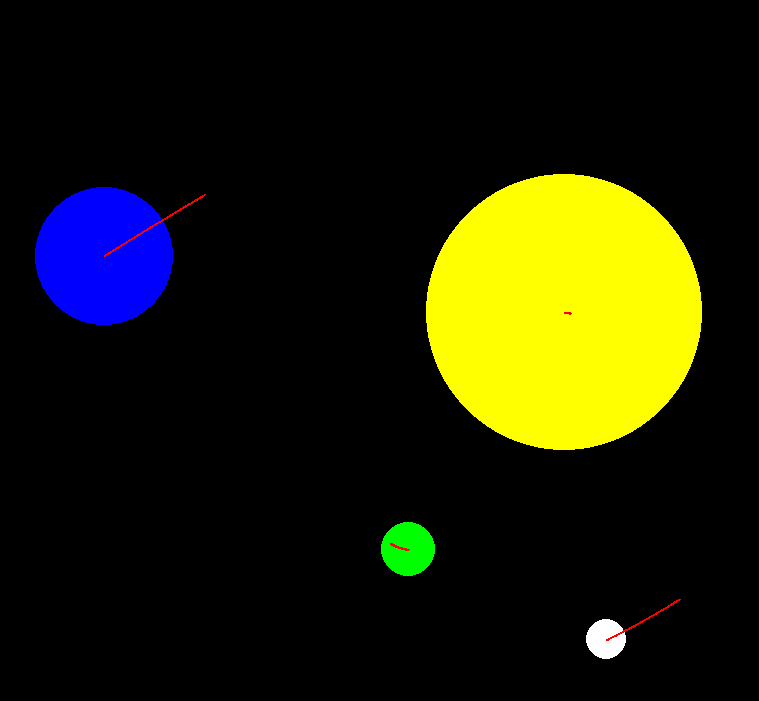

# 🌌  py_solar_sys (Solar system Sandbox Lite)

A 2D gravity simulation built with **Python** and **Pygame** where you can spawn planets, launch them with velocity, and watch them orbit, collide, or merge into bigger bodies. Think of it as a tiny version of *Universe Sandbox* — but coded from scratch!

---

## ✨ Features
- 🖱️ **Click & drag spawning**: drag sets initial velocity, so you can throw planets into orbit.
- 🪐 **Newtonian gravity**: all bodies pull on each other realistically.
- ☀️ **Stars vs planets**: stars act as massive bodies; planets can merge into bigger ones.
- 💥 **Merging**: collisions conserve momentum, creating larger bodies.
- 🎥 **Camera controls**:
  - Scroll → zoom in/out
  - Right/Middle drag → pan
  - `SPACE` → pause/unpause
  - `F` → toggle fullscreen
  - `Q` → quit simulation

---

## 🎮 Demo
Example:  


---

## 🔧 Installation & Running

Clone the repo:
```bash
git clone https://github.com/Anasarfeen123/gravity-sim.git
cd gravity-sim
```

Install dependencies:
```bash
pip install -r requirements.txt
```

Run the simulation:
```bash
python3 main.py
```

---

## 📂 Project Structure
```bash
gravity-sim/
│── planetarybody.py      # Planet & Star classes (physics, collisions, drawing)
│── main.py               # Main simulation loop & controls
│── requirements.txt      # Dependencies (pygame)
│── README.md             # This file
│── assets/               # screenshots, GIFs
```

---

## 🚀 Future Features

- 🌑 Black holes (supermassive objects that swallow anything nearby)

- 🌠 Supernovas (stars exploding into smaller planets/debris)

- 🎾 Elastic collision mode (bouncy planets instead of merging)

- 🎲 Random universe generator

- 💾 Save/load custom universes

---

## 🧑‍💻 Author

Built with ❤️ by <b> [Anas](https://github.com/Anasarfeen123/py_solar_sys) </b>